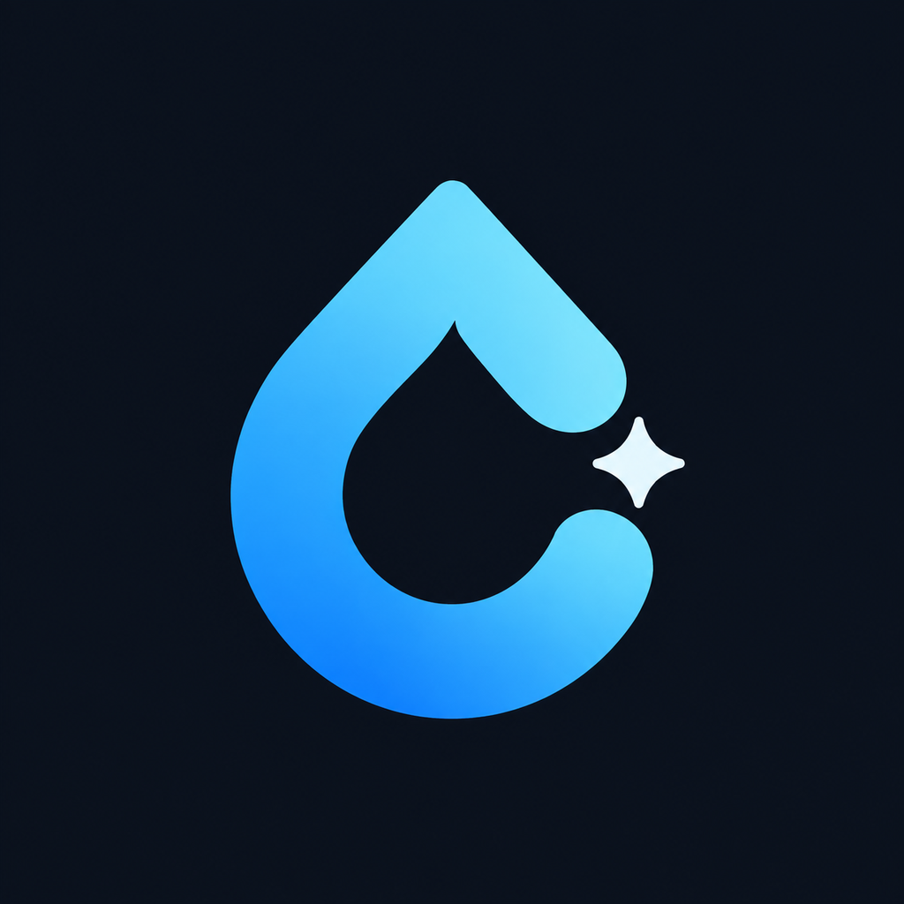

#  Siply

Siply is a local-first hydration tracker built with React Native, Expo 54, and expo-router. It stores hydration settings and history on the device, schedules local reminders, and does not require an account or backend.

## Current features

- Daily hydration target, active reminder window, sip size, gentle-goal threshold, and light/dark/system appearance.
- Three-tab interface: Today, History, and You, with a separate Settings route.
- Three bundled launcher-icon choices—Modern, Classic, and Glossy—selectable per device from Settings. Modern is the default.
- Quick logging with named drink presets, custom preset amounts, manual reordering, and recent time-of-day ordering.
- Responsive quick-log cards and preset-management controls for narrow phones and wider/oriented layouts.
- Per-entry logs with exact timestamps and amounts for the most recent seven days; 120 days of daily summaries are retained.
- Undo of the latest log on Today and swipe-to-delete for retained entries in History.
- Display and custom-entry conversion for millilitres, US fluid ounces, and cups. Stored values remain millilitres.
- A 28-day calendar heatmap, day-detail sheet, hourly activity, streaks, best hours by estimated/exact volume, and inset-safe 90-day line/bar trends with persistent date-and-volume press details, plus averages, goal-hit rate, and local heuristic insights.
- Optional bring-your-own-key AI features for OpenAI, Anthropic, Google Gemini, and NVIDIA NIM: Ask Siply offers one-tap questions grounded in local hydration summaries, while opt-in History annotations, daily recaps, and weekly reviews augment deterministic local insights.
- Shareable progress images in a native development/production build.
- JSON backup export/import with validation, confirmation, history merging, persisted-write verification, `.siply.json` file associations, and validated handling of generic file-provider URIs.
- Two read-only Android home-screen widgets (circular and linear) with current progress and the computed next reminder time. Tapping a widget opens Siply; Android requests a widget refresh every 30 minutes and app-side state changes request immediate refreshes.
- Milestone celebrations when a log completes a 7-, 30-, or 100-day streak.

## Notifications

Siply calculates reminder amounts from the remaining daily target and the remaining active window. It schedules a rolling 24-hour set of local notifications, up to 48 scheduled items, and can add nudges 5 and 10 minutes after a reminder.

Reminder notifications provide these actions:

- **I drank** logs the amount encoded in the notification and opens the app.
- **Snooze 30 min** schedules one replacement reminder.
- **Skip** dismisses the notification without logging.

The app also schedules a state-independent end-of-window summary with a **View History** action. Live totals are intentionally read after opening History instead of being frozen into notification text when the notification is scheduled. Reminder copy can be encouraging, minimal, or playful. Android uses separate sound and silent notification channels.

Siply reschedules after hydration, on relevant state changes, when returning to the foreground, after a restore, and through a best-effort Expo background task. Notification actions are deduplicated across restarts with a bounded 24-hour history. The background path reads and normalizes the same persisted Zustand snapshot as the foreground app. The operating system still controls whether and when background work runs, so device-level timing is not guaranteed.

## Optional AI

Siply does not provide an AI account or proxy requests through a Siply server. On iOS and Android, users can connect one or more provider keys and explicitly choose the active provider. OpenAI, Anthropic, and Gemini ask only for an API key; their endpoints and cost-conscious defaults are fixed internally:

- OpenAI: `gpt-5.6-luna`
- Anthropic: `claude-sonnet-5`, with thinking disabled for this lightweight workload
- Google Gemini: `gemini-3.5-flash-lite`, using its minimum supported thinking level

NVIDIA accepts an API key plus an editable HTTPS Base URL and Model ID. Its defaults are `https://integrate.api.nvidia.com/v1` and `nvidia/nemotron-3-ultra-550b-a55b`, so the hosted API works without extra configuration while self-hosted NIM deployments remain possible. Siply explicitly disables reasoning output for that default Nemotron model. A user-selected custom NIM model controls its own supported behavior.

Every key is verified with a small provider request before it is saved. Ask Siply provides locally selected suggested questions, keeps only the current on-screen conversation, and sends at most three prior question/answer pairs; chat transcripts are not persisted. If a provider reports that an answer hit its output limit, the partial answer is retained with an explicit **Continue** action—the app never starts an additional paid request without the user's tap. AI context contains bounded daily totals, seven days of hourly aggregates, targets, streaks, and other derived statistics—not raw log IDs or exact entry timestamps. AI responses are informational and not medical advice.

Automatic AI features are off by default and run only while History is visible, a connected key is usable, and the device is online. The current-day annotation is eligible initially, after at least 350 ml of accumulated intake change, when the daily target is crossed, or when historical/settings inputs change. Refreshes have a one-hour cooldown and a hard limit of three automatic attempts per local day; failed attempts count toward the limit. If activity changes after that limit, the stale AI copy is hidden and History continues showing its deterministic insight. An explicit **Refresh AI insight** action then lets the user choose whether to make another request.

History also provides a deterministic end-of-day recap after the active window closes (or on the following day), plus a completed Monday-to-Sunday weekly review after at least four tracked days. With automatic AI enabled, Siply may add one cached AI recap per completed day and one cached AI review per completed week. Late edits invalidate the matching AI recap/review instead of showing stale text. Truncated, malformed, or reasoning-like automatic output is discarded and never cached.

Offline, missing-key, invalid-key, timeout, and provider errors never replace History content with an error. An exact, still-current cached result remains visible; otherwise Siply silently shows only the deterministic local content. Removing a key preserves cached output. **Settings → Data backup → Delete saved AI insights** explicitly clears History annotations, daily recaps, and weekly reviews.

With automatic insights enabled and a deterministic insight available:

| Saved AI insight | Active key | Online | What History shows / does |
|---|---|---|---|
| Yes, and current | No | Either | Local insight plus the saved **AI insight**; no request |
| Yes, and current | Yes | No | Local insight plus the saved **AI insight**; no request |
| Yes, and current | Yes | Yes | Local insight plus the saved **AI insight**; checks the cooldown/change rules before refreshing |
| Yes, but stale | Either | Either | Local insight only; stale AI copy is hidden |
| No | No | Either | Local insight only; no request |
| No | Yes | No | Local insight only; no request |
| No | Yes | Yes | Local insight while fetching; adds **AI insight** only after a successful response |

Turning the option off hides, but does not delete, a saved annotation. History labels generated text only as **AI insight**—it does not expose the provider name or cache date in the UI.

## Privacy and offline behavior

There are no accounts, Siply backend, analytics SDKs, crash-reporting SDKs, or cloud sync. Core tracking, reminders, History, and deterministic insights remain offline-first. Hydration data stays in AsyncStorage unless the user explicitly exports or shares it, or opts into a direct AI-provider request after accepting the on-screen disclosure. AsyncStorage is app-private but is not an encrypted-at-rest vault, and uninstalling the app removes its local data unless the user has saved a backup.

AI provider keys are stored with Expo SecureStore and are excluded from Siply backups and diagnostics. Non-secret AI preferences and cached annotations use separate AsyncStorage keys that are also excluded from hydration backups. AI calls go directly from the device to the active provider. Ask Siply has a dedicated offline state and automatically re-enables after reconnection; the rest of the app does not depend on network access. AI setup is intentionally unavailable on web because Siply does not have a secure web key-storage implementation.

## Architecture

The app uses expo-router for file-based navigation and a feature-vertical source layout:

```text
app/                                  routes and application wiring
src/core/                             constants, time/unit helpers, storage normalization
src/features/hydration/domain/        calculations, schedule, history, domain types
src/features/hydration/state/         Zustand store and persistence
src/features/hydration/notifications/ scheduling, actions, background task, diagnostics
src/features/hydration/backup/        export, import, validation, merge
src/features/hydration/ai/            redacted context, provider adapters, secure keys, cache
src/features/hydration/widgets/       Android widget renderer and task handler
src/features/hydration/ui/            hydration-specific UI
src/shared/                            reusable components, hooks, network state, theme, haptics
scripts/                               icon generation
```

State is managed by Zustand selectors. Zustand's persistence middleware stores hydration state as one JSON value under `siply:hydration_store:v1`, with schema version 3. Older Zustand schema versions are normalized through the same migration path; the retired six-key persistence model is no longer present. Separate AsyncStorage keys hold notification-action deduplication, diagnostics, first-launch time, last-export time, non-secret AI preferences, cached AI annotations/recaps/reviews, and automatic-request counters; those operational values are not included in backups. AI credentials live separately in SecureStore.

History days may contain `entries` (`id`, ISO timestamp, and `amountMl`). Entry arrays are retained for seven days; daily totals, goals, hourly counts, and other summaries are retained for 120 days. Backup merging unions retained entries by ID where possible and otherwise keeps the higher known daily total.

Daily progress rolls over just after local midnight while the app is active. If the operating system suspends the app, the existing foreground-resume check performs the rollover before the user continues.

## Setup

Requirements:

- Node.js and npm
- Expo/EAS tooling available through `npx`
- Android Studio or Xcode for local native builds, as applicable
- An Expo account for EAS builds

Install dependencies:

```bash
npm install
```

Run the unit tests and TypeScript checks:

```bash
npm test
npm run typecheck
```

Generate the primary, adaptive, splash, and alternate PNG icon assets from their source artwork when an icon changes:

```bash
npm run generate:icons
```

Start Metro for a custom development client:

```bash
npm start
```

The `start` script runs `expo start --dev-client`; `npm run android` and `npm run ios` start their Expo targets. A `web` script is present, but the repository does not currently include the React Native Web runtime dependencies, and AI setup is mobile-only. Android widgets, notification channels/actions, bundled notification sound, background tasks, file associations, network monitoring, secure AI-key storage, and launcher-icon selection require a native development or release build. Rebuild the development client after adding or changing native Expo modules or bundled icon choices.

## Builds

Create EAS development clients:

```bash
npm run dev:android
npm run dev:ios
```

Create internal preview builds:

```bash
npm run build:android:preview
npm run build:ios:preview
```

Create production builds for both platforms:

```bash
npm run build:all:production
```

Android is configured with package `com.yourstruggle11.siply`, ProGuard, and resource shrinking. The repository does not currently declare an iOS `bundleIdentifier`; configure one before relying on iOS distribution. Internal iOS distribution also requires an Apple Developer account and registered devices (`npm run eas:devices`).
