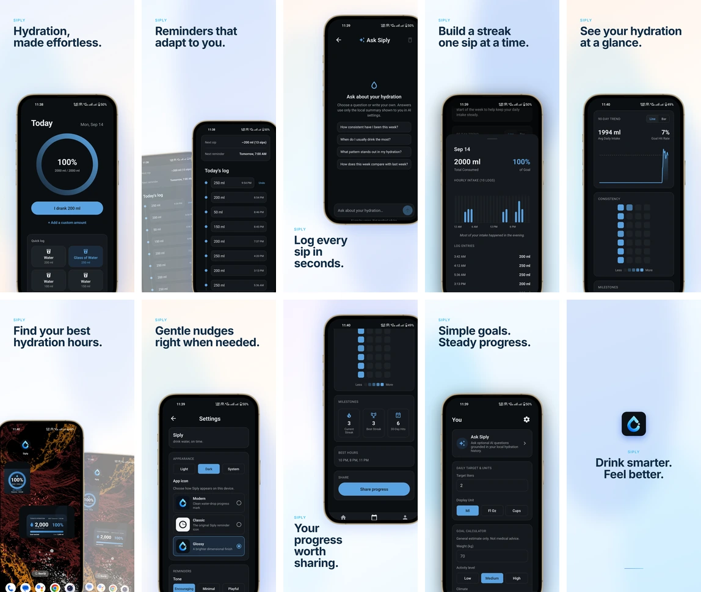
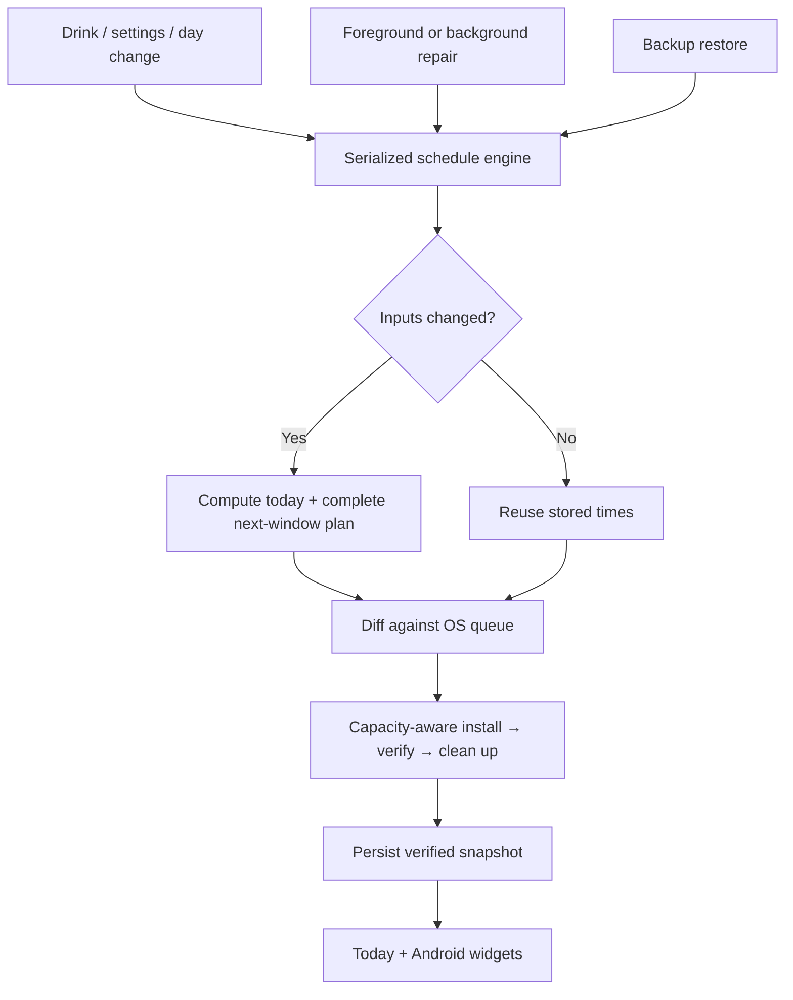

#  Siply

Siply is a local-first hydration tracker built with React Native, Expo 54, and expo-router. It stores hydration settings and history on the device, schedules local reminders, and does not require an account or backend.

🌐 **Website & Download:** [try-siply.vercel.app](https://try-siply.vercel.app/)

## Demo



## Current features

- Daily hydration target, active reminder window, sip size, gentle-goal threshold, and light/dark/system appearance.
- Three-tab interface: Today, History, and You, with a separate Settings route.
- Three bundled launcher-icon choices—Modern, Classic, and Glossy—selectable per device from Settings. Modern is the default.
- Quick logging with named drink presets, custom preset amounts, manual reordering, and recent time-of-day ordering.
- Responsive quick-log cards and preset-management controls for narrow phones and wider/oriented layouts.
- Per-entry logs with exact timestamps and amounts for the most recent seven days; 120 days of daily summaries are retained.
- Undo of the latest log on Today and swipe-to-delete for retained entries in History.
- Display and custom-entry conversion for millilitres, US fluid ounces, and cups. Stored values remain millilitres.
- A 28-day calendar heatmap, day-detail sheet, hourly activity, streaks, best hours by estimated/exact volume, and inset-safe 90-day line/bar trends with persistent date-and-volume press details, plus averages, goal-hit rate, and local heuristic insights.
- Optional bring-your-own-key AI features for OpenAI, Anthropic, Google Gemini, and NVIDIA NIM: Ask Siply offers one-tap questions grounded in local hydration summaries, while opt-in History annotations, daily recaps, and weekly reviews augment deterministic local insights.
- Shareable progress images in a native development/production build.
- JSON backup export/import with validation, confirmation, history merging, persisted-write verification, `.siply.json` file associations, and validated handling of generic file-provider URIs.
- Two read-only Android home-screen widgets (circular and linear) with current progress and the next OS-verified reminder time. Tapping a widget opens Siply; Android requests a widget refresh every 30 minutes and verified plan changes request immediate refreshes.
- Milestone celebrations when a log completes a 7-, 30-, or 100-day streak.

## Notifications

Siply uses one serialized schedule engine for foreground, restore, background, and settings flows. It persists a versioned plan snapshot and reconciles it against the real OS queue. Replacements are installed and verified transactionally; when peak queue capacity prevents old and new plans from coexisting, optional and far-future obsolete requests are removed first while the nearest reminder is protected as long as possible. A failed replacement is rolled back to the last coherent OS-confirmed plan whenever possible, and incomplete schedules are retried automatically using the latest hydration state. The Today screen reports restoration while coverage is missing or partial, and reports a blocked Android reminder channel separately.

Reminder times are stable. A plan is recomputed when hydration state or reminder settings meaningfully change, or when the local day rolls over—not merely because the app was reopened or time passed. Foreground and background checks verify and repair the stored plan without shifting it. The Today screen and Android widgets read only OS-verified families from this snapshot, so their next-reminder time is not independently guessed.



The engine calculates reminder amounts from the remaining target and available opportunities, caps any one reminder at 400 ml, and schedules the rest of the current hydration day plus the complete next active window. The queue budget is 48 items, with six positions reserved for transient snooze/test requests. Base reminders are selected first, summaries next, and optional nudges use only the remaining capacity, so nudges cannot displace core coverage. Scheduled notification copy is fixed when the OS request is created; a meaningful settings or hydration change resubmits even stable identifiers so their sound, tone, amount, and actions stay current. Future amounts follow the “no new drink” path, so if a reminder is ignored, later already-scheduled reminders can ask for a larger—but capped—amount without depending on background JavaScript. Logging a drink cancels that reminder family, recomputes the plan, and enforces at least 30 quiet minutes before the next same-day reminder.

When **Nudges** is enabled, Siply selects up to four reminder families per hydration day, distributed across the active window and biased toward historically lower-adherence hours. Each selected family receives follow-ups at +5 and +10 minutes, for at most eight normal follow-up notifications per day. **Extra catch-up nudge** is separately opt-in and may add one more +5/+10 family only after at least 35% of the active window has elapsed and the user is meaningfully behind the expected pace. Disabling Nudges disables both normal and catch-up follow-ups. Capacity-suppressed nudges are not counted as used.

Reminder notifications provide these actions:

- **I drank** logs the amount encoded in the notification and opens the app.
- **Snooze 30 min** cancels any pending nudges for the original slot and schedules one replacement reminder. It is not offered when a full 30-minute snooze would reach or cross the active-window end.
- **Skip** cancels the original reminder family without logging.

Android registers a headless notification-action task so Skip and Snooze can still be handled while the app is backgrounded or terminated. iOS opens Siply for those actions because Expo only supports terminated-state action tasks on Android. Action IDs are persisted for 24 hours and capped at 50 entries so a response delivered again after launch is not applied twice; a failed action releases its claim so a redelivery can retry it. Skip and Snooze immediately remove the handled family from the verified snapshot used by Today and widgets. Ordinary dismissal does not replan or cancel the follow-up family; on iOS it is recorded only in the local diagnostic journal.

End-of-day scheduling has a reserved 30-minute closeout period. Regular reminders stop before it; at most one calm **Last call** can be placed at the boundary, it never receives nudges, and no aggressive catch-up burst is created afterward. Quantities smaller than one configured sip are suppressed. A state-independent summary can run at the active-window end with **View History**. Active windows must start and finish within the same calendar day; equal or overnight windows are rejected until Siply has a first-class Hydration Day model.

**Weekend rhythm** is optional and off by default. It becomes available only after at least four observed weeks, six weekend log days, twelve weekday log days, and a median weekend first-log time at least 60 minutes later than weekdays. When enabled, it delays weekend starts by at most 60 minutes while preserving the configured end time. Siply shows a one-time in-app readiness notice when this setting becomes useful.

On Android 12+, **Precise reminder timing** links to the system’s Exact Alarm access screen. Normal notification permission is still required and remains separate. Exact Alarm access can improve delivery during idle or battery-saving periods but cannot guarantee delivery at an exact second. Siply educates at most twice—first after three days, then no sooner than 30 days—and detects grant/revocation changes on cold start and foreground. A change forces verified reminders to be resubmitted rather than trusting stale native queue metadata. Notification permission is requested only from an explicit onboarding or Settings action. Precise timing and the background/action integrations require a native build that already includes their configuration.

Daily progress rolls over just after local midnight while the app is active and is repaired on foreground after suspension. A best-effort Expo background task runs no more often than the OS allows (configured with a six-hour minimum) to verify and replenish coverage; it reports failed or partial native scheduling as a failed background run rather than a false success. Core next-day coverage does not depend on that task running at an exact time. Local diagnostics retain at most 250 scheduler/action/background events for seven days, including planned, scheduled, suppressed, failed, and extraneous request counts. They are excluded from backups and never uploaded automatically. The operating system can still delay notifications because of device policy, battery restrictions, or revoked permissions.

## Optional AI

Siply does not provide an AI account or proxy requests through a Siply server. On iOS and Android, users can connect one or more provider keys and explicitly choose the active provider. OpenAI, Anthropic, and Gemini ask only for an API key; their endpoints and cost-conscious defaults are fixed internally:

- OpenAI: `gpt-5.6-luna`
- Anthropic: `claude-sonnet-5`, with thinking disabled for this lightweight workload
- Google Gemini: `gemini-3.5-flash-lite`, using its minimum supported thinking level

NVIDIA accepts an API key plus an editable HTTPS Base URL and Model ID. Its defaults are `https://integrate.api.nvidia.com/v1` and `nvidia/nemotron-3-ultra-550b-a55b`, so the hosted API works without extra configuration while self-hosted NIM deployments remain possible. Siply explicitly disables reasoning output for that default Nemotron model. A user-selected custom NIM model controls its own supported behavior.

Every key is verified with a small provider request before it is saved. Ask Siply provides locally selected suggested questions, keeps only the current on-screen conversation, and sends at most three prior question/answer pairs; chat transcripts are not persisted. If a provider reports that an answer hit its output limit, the partial answer is retained with an explicit **Continue** action—the app never starts an additional paid request without the user's tap. AI context contains bounded daily totals, seven days of hourly aggregates, targets, streaks, and other derived statistics—not raw log IDs or exact entry timestamps. AI responses are informational and not medical advice.

Automatic AI features are off by default and run only while History is visible, a connected key is usable, and the device is online. The current-day annotation is eligible initially, after at least 350 ml of accumulated intake change, when the daily target is crossed, or when historical/settings inputs change. Refreshes have a one-hour cooldown and a hard limit of three automatic attempts per local day; failed attempts count toward the limit. If activity changes after that limit, the stale AI copy is hidden and History continues showing its deterministic insight. An explicit **Refresh AI insight** action then lets the user choose whether to make another request.

History also provides a deterministic end-of-day recap after the active window closes (or on the following day), plus a completed Monday-to-Sunday weekly review after at least four tracked days. With automatic AI enabled, Siply may add one cached AI recap per completed day and one cached AI review per completed week. Late edits invalidate the matching AI recap/review instead of showing stale text. Truncated, malformed, or reasoning-like automatic output is discarded and never cached.

Offline, missing-key, invalid-key, timeout, and provider errors never replace History content with an error. An exact, still-current cached result remains visible; otherwise Siply silently shows only the deterministic local content. Removing a key preserves cached output. **Settings → Data backup → Delete saved AI insights** explicitly clears History annotations, daily recaps, and weekly reviews.

With automatic insights enabled and a deterministic insight available:

| Saved AI insight | Active key | Online | What History shows / does |
|---|---|---|---|
| Yes, and current | No | Either | Local insight plus the saved **AI insight**; no request |
| Yes, and current | Yes | No | Local insight plus the saved **AI insight**; no request |
| Yes, and current | Yes | Yes | Local insight plus the saved **AI insight**; checks the cooldown/change rules before refreshing |
| Yes, but stale | Either | Either | Local insight only; stale AI copy is hidden |
| No | No | Either | Local insight only; no request |
| No | Yes | No | Local insight only; no request |
| No | Yes | Yes | Local insight while fetching; adds **AI insight** only after a successful response |

Turning the option off hides, but does not delete, a saved annotation. History labels generated text only as **AI insight**—it does not expose the provider name or cache date in the UI.

## Privacy and offline behavior

There are no accounts, Siply backend, analytics SDKs, crash-reporting SDKs, or cloud sync. Core tracking, reminders, History, and deterministic insights remain offline-first. Hydration data stays in AsyncStorage unless the user explicitly exports or shares it, or opts into a direct AI-provider request after accepting the on-screen disclosure. AsyncStorage is app-private but is not an encrypted-at-rest vault, and uninstalling the app removes its local data unless the user has saved a backup.

AI provider keys are stored with Expo SecureStore and are excluded from Siply backups and diagnostics. Non-secret AI preferences and cached annotations use separate AsyncStorage keys that are also excluded from hydration backups. AI calls go directly from the device to the active provider. Ask Siply has a dedicated offline state and automatically re-enables after reconnection; the rest of the app does not depend on network access. AI setup is intentionally unavailable on web because Siply does not have a secure web key-storage implementation.

## Architecture

The app uses expo-router for file-based navigation and a feature-vertical source layout:

```text
app/                                  routes and application wiring
src/core/                             constants, time/unit helpers, storage normalization
src/features/hydration/domain/        calculations, schedule, history, domain types
src/features/hydration/state/         Zustand store and persistence
src/features/hydration/notifications/ schedule engine, scheduling, actions, background task, diagnostics
src/features/hydration/backup/        export, import, validation, merge
src/features/hydration/ai/            redacted context, provider adapters, secure keys, cache
src/features/hydration/widgets/       Android widget renderer and task handler
src/features/hydration/ui/            hydration-specific UI
src/shared/                            reusable components, hooks (incl. schedule snapshot), network state, theme, haptics
scripts/                               icon generation and native-runtime validation
website/                               Astro + Tailwind static marketing site
```

State is managed by Zustand selectors. Zustand's persistence middleware stores hydration state as one JSON value under `siply:hydration_store:v1`, with schema version 4. Older Zustand schema versions are normalized through the same migration path; the retired six-key persistence model is no longer present. Separate AsyncStorage keys hold the OS-verified schedule snapshot, daily nudge and handled-family ledgers, notification-action deduplication, bounded diagnostics, intelligent-feature prompt state, first-launch time, last-export time, non-secret AI preferences, cached AI annotations/recaps/reviews, and automatic-request counters. These operational values are not included in backups. AI credentials live separately in SecureStore.

History days may contain `entries` (`id`, ISO timestamp, and `amountMl`). Entry arrays are retained for seven days; daily totals, goals, hourly counts, and other summaries are retained for 120 days. Backup merging unions retained entries by ID where possible and otherwise keeps the higher known daily total.

Daily progress rolls over just after local midnight while the app is active. If the operating system suspends the app, the existing foreground-resume check performs the rollover before the user continues.

## Setup

Requirements:

- Node.js 20.19 or newer and npm
- Expo/EAS tooling available through `npx`
- Android Studio or Xcode for local native builds, as applicable
- An Expo account for EAS builds

Install dependencies:

```bash
npm install
```

Run the unit tests and TypeScript checks:

```bash
npm test
npm run typecheck
npm run validate:native-runtime
```

Generate the primary, adaptive, splash, and alternate PNG icon assets from their source artwork when an icon changes:

```bash
npm run generate:icons
```

Start Metro for a custom development client:

```bash
npm start
```

The `start` script runs `expo start --dev-client`; `npm run android` and `npm run ios` start their Expo targets. The root `web` script is an Expo command, but the mobile package does not currently include React Native Web runtime dependencies, and AI setup is mobile-only. Android widgets, precise timing, notification channels/actions, bundled notification sound, background tasks, file associations, network monitoring, secure AI-key storage, and launcher-icon selection require a native development or release build. Rebuild the development client after changing native modules, permissions, config plugins, or bundled icon choices.

Run the marketing site independently:

```bash
cd website
npm install
npm run dev
```

## Builds

Create EAS development clients:

```bash
npm run dev:android
npm run dev:ios
```

Create internal preview builds:

```bash
npm run build:android:preview
npm run build:ios:preview
```

Create production builds for both platforms:

```bash
npm run build:all:production
```

Android is configured with package `com.yourstruggle11.siply`, ProGuard, and resource shrinking. The repository does not currently declare an iOS `bundleIdentifier`; configure one before relying on iOS distribution. Internal iOS distribution also requires an Apple Developer account and registered devices (`npm run eas:devices`).

Siply keeps `runtimeVersion.policy = "appVersion"`. Every checked-in EAS build and update script runs `validate:native-runtime`, and CI runs the same guard. The accepted Expo native fingerprint lives in `native-runtime-baseline.json`. If native inputs change:

1. Bump `expo.version` in `app.json` (and the package version; update local build numbers where appropriate).
2. Review the native change.
3. Run `npm run accept:native-runtime` to record the new version/fingerprint pair.
4. Run the normal build or update command.

The guard rejects native changes under an unchanged app version and rejects a version that has not been accepted. EAS uses remote build-number auto-incrementing, while the app version remains the OTA runtime boundary. Current app version is `1.2.0`; the checked-in local Android version code and iOS build number are `4`.
